<p align="right">
  <strong>English</strong> · <a href="README.zh-CN.md">简体中文</a>
</p>

<h1 align="center">AI-Assisted 6G Indoor Localization Digital Twin</h1>

<p align="center">
  A CPU-only, simulation-first framework for reproducible indoor localization,
  robustness evaluation, and interactive result replay.
</p>

<p align="center">
  
  
  
  
</p>

<p align="center">
  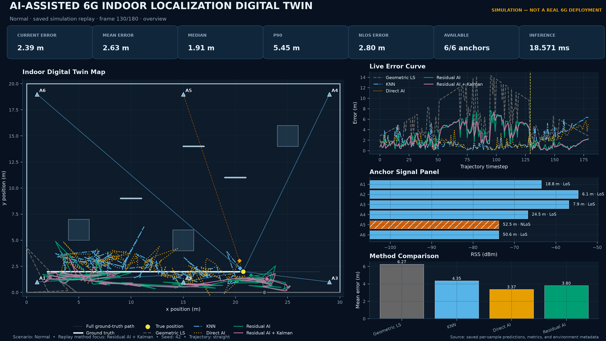
</p>

## Why this project?

Indoor positioning is difficult because walls, obstacles, multipath-like bias,
measurement noise, and unavailable anchors break the assumptions of simple
geometric estimators. This project turns those effects into a configurable
two-dimensional digital twin and uses the same saved scenarios to compare:

- **Geometric least squares** — transparent and model-based;
- **KNN fingerprinting** — a classical site-specific baseline;
- **Direct AI** — signal features mapped directly to coordinates;
- **Residual AI** — learned corrections applied to the geometric estimate;
- **Kalman filtering** — evaluated separately on continuous trajectories.

The repository connects environment generation, RSS-like measurement
simulation, model training, spatial-holdout evaluation, robustness sweeps,
publication figures, and a Streamlit replay dashboard in one reproducible
pipeline.

> **Scope.** Every number and image in this repository comes from a
> software-only simulator. The project does not claim a physical 6G
> deployment, a standardized 3GPP channel, or real-building accuracy.

## At a glance

| Item | Packaged full-profile setting |
|---|---|
| Environment | 30 m × 20 m indoor map |
| Infrastructure | 6 fixed anchors |
| Scenarios | Normal, High Noise, Strong Blockage, Anchor Failure, Domain Shift |
| Main protocol | Normal spatial holdout |
| Full-profile seeds | 42, 123, 2026, 31415, 27182 |
| Data per seed | 20,000 train / 4,000 validation / 6,000 in-domain test / 4,000 spatial holdout |
| Execution | Python 3.12.4, Windows 11, CPU-only |

## System design

<p align="center">
  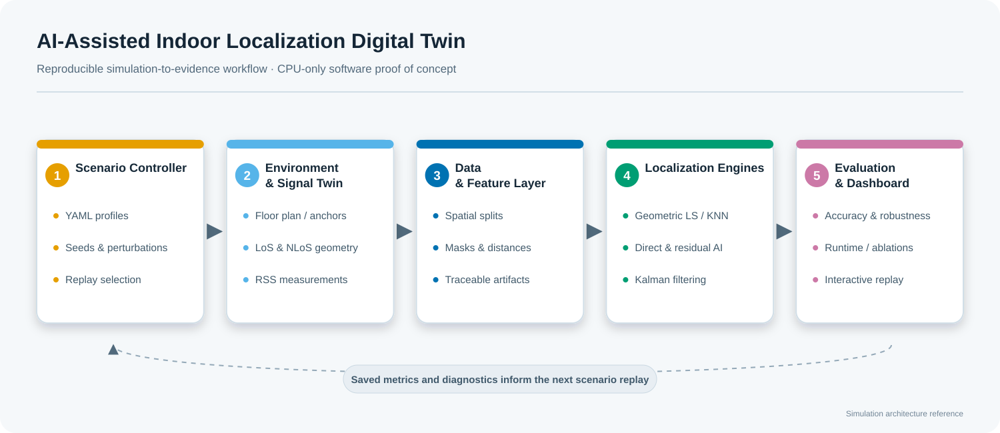
</p>

The framework is divided into four auditable layers:

1. **Environment twin** — anchors, walls, obstacles, semantic regions, and
   trajectories defined by YAML.
2. **Wireless measurement twin** — distance, wall intersection, LoS/NLoS,
   RSS, structured bias, noise, hardware bias, and anchor availability.
3. **Localization and filtering** — four point estimators plus trajectory-only
   Kalman filtering.
4. **Evaluation and visualization** — error metrics, stress tests, CSV/JSON
   provenance, paper figures, and saved-result dashboard replay.

## Five replayable scenarios

<table>
  <tr>
    <td width="50%" align="center">
      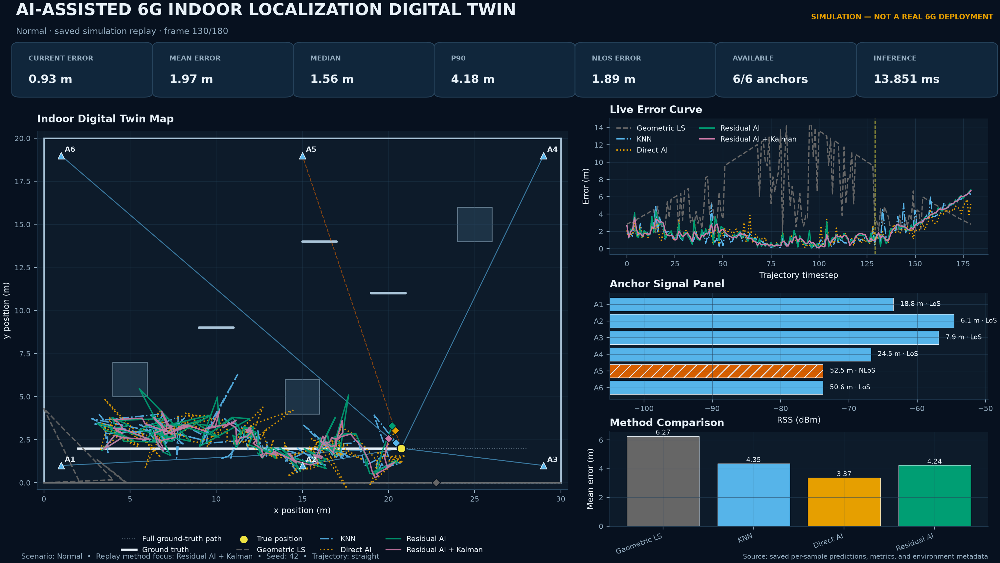<br>
      <strong>Normal</strong><br>
      Nominal propagation and low random dropout.
    </td>
    <td width="50%" align="center">
      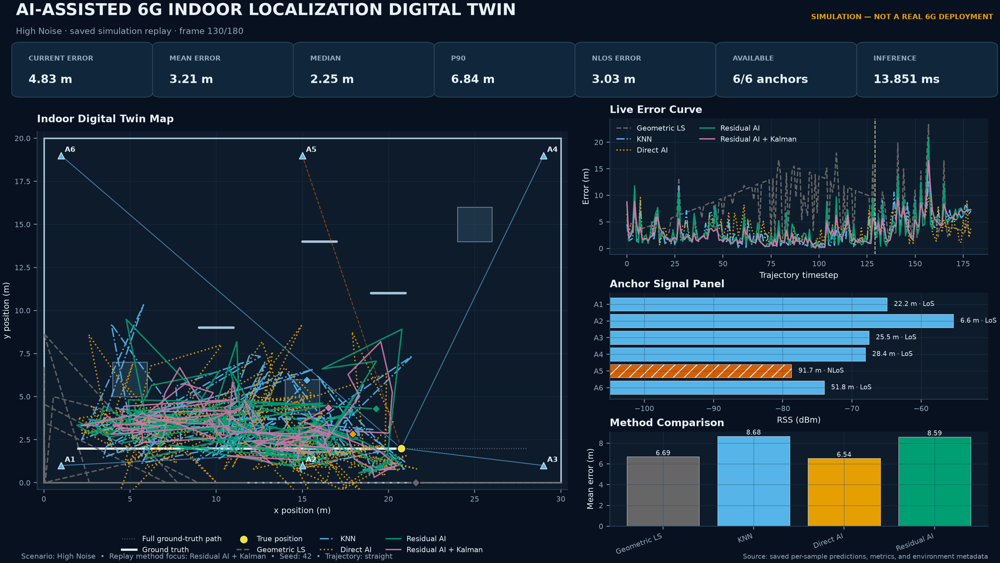<br>
      <strong>High Noise</strong><br>
      Increased RSS uncertainty.
    </td>
  </tr>
  <tr>
    <td width="50%" align="center">
      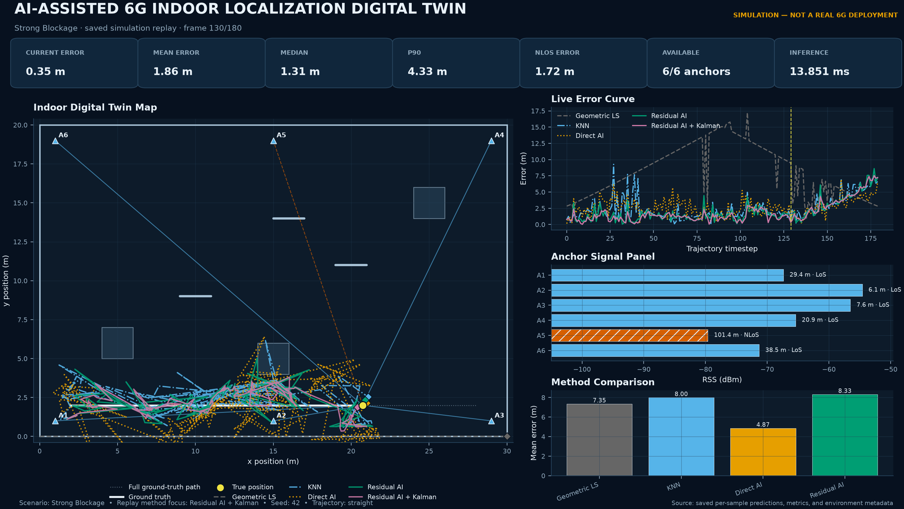<br>
      <strong>Strong Blockage</strong><br>
      Larger wall and NLoS bias.
    </td>
    <td width="50%" align="center">
      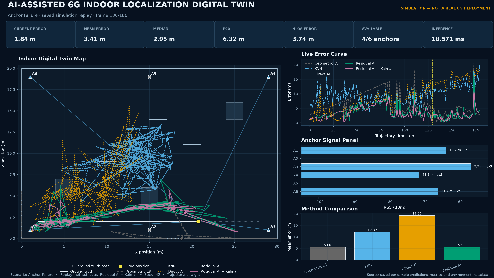<br>
      <strong>Anchor Failure</strong><br>
      Missing infrastructure and availability masks.
    </td>
  </tr>
  <tr>
    <td colspan="2" align="center">
      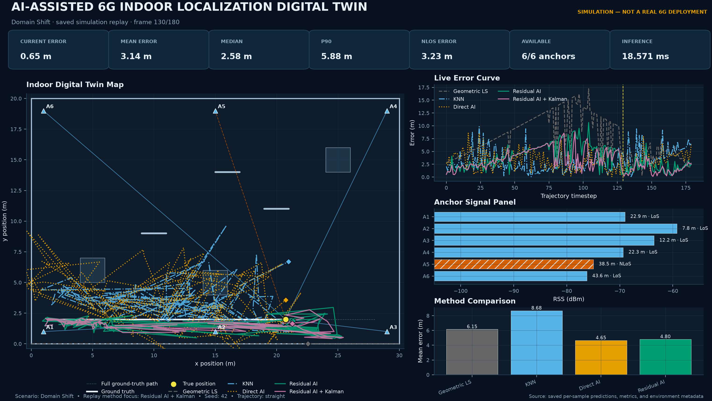<br>
      <strong>Domain Shift</strong><br>
      Changed propagation and hardware-bias parameters.
    </td>
  </tr>
</table>

## Full-profile results

The main table aggregates five independently generated and trained
spatial-holdout runs, with 4,000 evaluation samples per seed.

| Method | Mean error (m) | RMSE (m) | Median (m) | P90 (m) | Warmed one-row time (ms) |
|---|---:|---:|---:|---:|---:|
| Geometric LS | 5.36 | 6.16 | 4.81 | 9.58 | 2.72 |
| KNN | 7.43 | 7.92 | 7.11 | 11.08 | 1.44 |
| **Direct AI** | **4.27** | **4.74** | **4.08** | **6.82** | **1.34** |
| Residual AI | 7.29 | 7.75 | 7.08 | 10.39 | 14.38 |

Under this specific protocol, Direct AI reduced mean error by **20.4%**
relative to Geometric LS. The ranking is not universal: Geometric LS remained
stronger under critical anchor failures, and Residual AI did not improve the
main baseline. Negative results are intentionally retained.

<table>
  <tr>
    <td width="50%" align="center">
      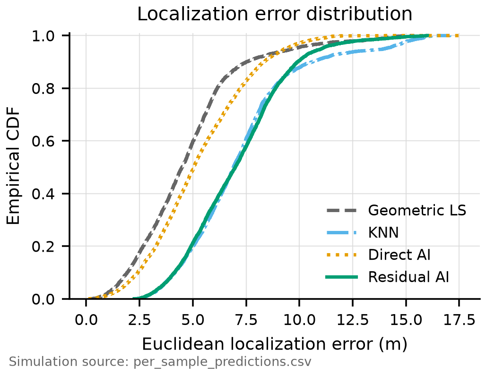<br>
      <strong>Error CDF</strong><br>
      Seed-42 spatial-holdout diagnostic; not a pooled five-seed CDF.
    </td>
    <td width="50%" align="center">
      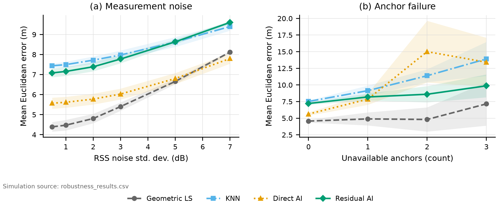<br>
      <strong>Robustness</strong><br>
      Noise and anchor-unavailability sweeps. The anchor panel pools random
      and fixed-critical protocols at overlapping failure counts.
    </td>
  </tr>
  <tr>
    <td width="50%" align="center">
      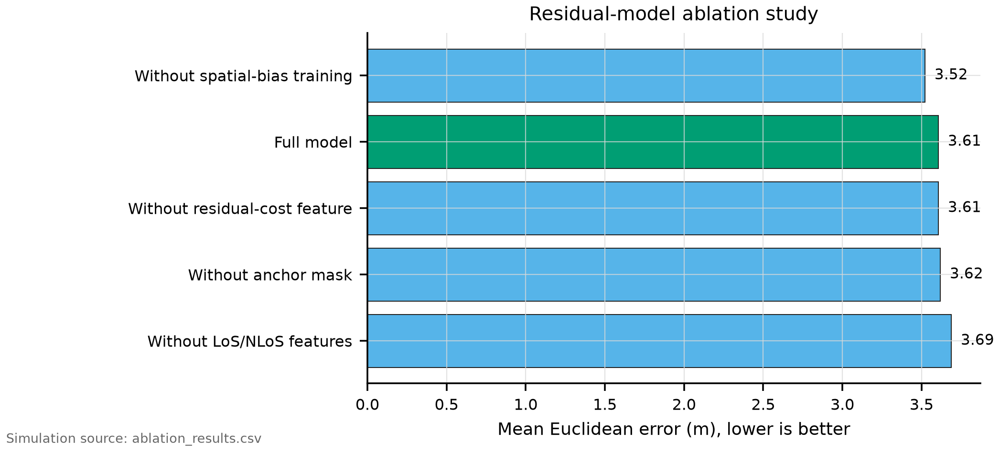<br>
      <strong>Ablation</strong><br>
      LoS/NLoS features helped the saved residual model, while spatial-bias
      training did not.
    </td>
    <td width="50%" align="center">
      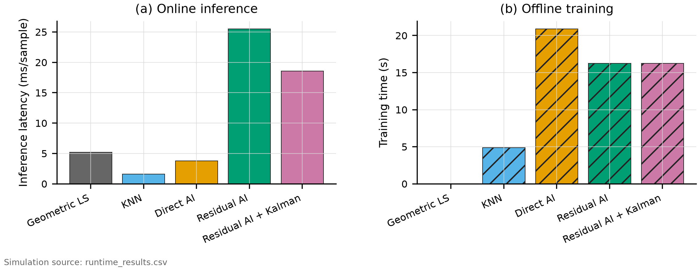<br>
      <strong>Runtime</strong><br>
      Local CPU online-inference and offline-training measurements.
    </td>
  </tr>
</table>

Detailed CSV tables, LaTeX tables, figures, screenshots, configuration, seeds,
and the source-run manifest are available in
[`results/full-profile/`](results/full-profile/README.md).

## Try the dashboard in three minutes

The repository includes a compact 4,500-row replay in `outputs/latest/`.
It contains 180 trajectory frames for five algorithms in each of the five
scenarios, so the dashboard works immediately without downloading model
checkpoints or retraining. Its `manifest.json` records the compact file sizes
and hashes; `source_run_manifest.json` preserves the original Full-run record.

After creating the GitHub repository, replace `YOUR_GITHUB_USERNAME` in the
two clone commands below with the repository owner's account name.

### Windows PowerShell

```powershell
git clone https://github.com/YOUR_GITHUB_USERNAME/AI-Assisted-6G-Indoor-Localization-Digital-Twin.git
cd AI-Assisted-6G-Indoor-Localization-Digital-Twin

python -m venv .venv
& '.\.venv\Scripts\python.exe' -m pip install --upgrade pip
& '.\.venv\Scripts\python.exe' -m pip install -e '.[dev]'
& '.\.venv\Scripts\python.exe' -m streamlit run app.py
```

### macOS / Linux

```bash
git clone https://github.com/YOUR_GITHUB_USERNAME/AI-Assisted-6G-Indoor-Localization-Digital-Twin.git
cd AI-Assisted-6G-Indoor-Localization-Digital-Twin

python3 -m venv .venv
.venv/bin/python -m pip install --upgrade pip
.venv/bin/python -m pip install -e '.[dev]'
.venv/bin/python -m streamlit run app.py
```

The page only filters and replays saved simulation records. Changing a
dashboard control does not retrain a model or silently fabricate new data.

## Reproduce the experiments

Run all commands from the repository root.

```bash
# Faster end-to-end profile
python scripts/run_pipeline.py --profile quick

# Five-seed profile used for the packaged result tables
python scripts/run_pipeline.py --profile full

# Re-export publication figures from an existing complete run
python scripts/export_report_assets.py \
  --results-dir outputs/latest \
  --output-dir report_assets \
  --include-dashboard
```

The Quick profile is intended for development and smoke testing. The Full
profile trains larger models and performs broader multi-seed evaluation; it
is CPU-intensive and can take roughly 15–40 minutes depending on the machine.

After editable installation, the main pipeline is also available as:

```bash
localization-twin --profile quick
```

## Test

```bash
python -m pytest -q --basetemp .test-tmp/pytest
```

The 32 tests cover geometry, propagation, deterministic data generation,
spatial splitting, all estimators, Kalman filtering, metrics, visualization
contracts, and a tiny end-to-end pipeline.

## Repository layout

```text
.
├── app.py                         # Streamlit saved-result dashboard
├── config/                        # Default, Quick, and Full YAML profiles
├── src/localization_twin/         # Simulation, models, evaluation, reporting
├── scripts/                       # Pipeline and export entry points
├── tests/                         # Unit, visualization, and smoke tests
├── outputs/latest/                # Compact GitHub-friendly dashboard replay
├── results/full-profile/
│   ├── figures/                   # PDF/PNG/SVG publication visuals
│   ├── screenshots/               # Five scenario previews
│   ├── tables/                    # Result CSVs
│   ├── latex/                     # Ready-to-include LaTeX tables
│   └── provenance/                # Visual-asset protocol and hashes
└── docs/                          # Experiment design and architecture source
```

Large model checkpoints, full data splits, and the 59 MB raw per-sample
prediction table are deliberately not versioned. They are generated by the
pipeline, while the compact replay and all report-facing results remain in
the repository. See the [result package notes](results/full-profile/README.md)
for the exact boundary.

## Reproducibility notes

- Random processes are controlled by the resolved YAML and recorded seeds.
- Main spatial-holdout results retrain independently for each evaluation seed.
- Robustness sweeps keep the root-seed model fixed and vary measurement seeds;
  the CSV records both fields explicitly.
- Scalers, imputers, and model selection use training/validation data only.
- `manifest.json` records the profile, platform, package versions, sample
  counts, algorithms, and generated-file inventory.
- Every paper-facing claim should remain conditional on the saved simulator
  configuration.

## Limitations

This is a lightweight two-dimensional RSS twin. It does not model a complete
3GPP Indoor Factory channel, CIR/CSI, antenna arrays, synchronization error,
three-dimensional multipath, dynamic human blockage, or a synchronized
physical twin. Domain-shift experiments are controlled simulator stress tests,
not evidence of transfer to a real building.
